# Totality Precatórios - TJRJ Automator

**Production-ready web scraper** for extracting court-ordered payment (precatório) data from the Rio de Janeiro Court of Justice (TJRJ) portal.

## 🌐 Production Access

| Item | Value |
|------|-------|
| **URL** | http://209.126.12.243:8501 |
| **SSH** | `ssh root@209.126.12.243` |
| **Path** | `/root/charles/totality-precatorios` |

---

## 🏗️ Architecture


---

## 🎯 Features

| Feature | Description |
|---------|-------------|
| **V6 Orchestrator** | Complete workflow with gap detection and recovery |
| **Decoupled UI V2** | Streamlit UI that doesn't interfere with extraction |
| **1-20 Workers** | Configurable parallel workers |
| **Real-time Progress** | Entity table + terminal view |
| **Gap Recovery** | Auto-detects and re-extracts failed entities |
| **Excel Export** | Auto-filter, styled headers, freeze panes |
| **File Management** | Download/delete files from UI |

---

## 🚀 Quick Start

### Installation

```bash
# 1. Clone and enter project
cd /path/to/Charles

# 2. Create virtual environment
python3 -m venv venv
source venv/bin/activate

# 3. Install dependencies
pip install -r requirements.txt
playwright install chromium

# 4. Start UI
streamlit run app/app_v2.py --server.port 8501
```

### Command Line

```bash
# V6 Orchestrator (recommended)
python main_v6_orchestrator.py --regime especial --num-processes 10

# V5 Direct (without gap recovery)
python main_v5_all_entities.py --regime geral --num-processes 15
```

---

## 📊 Extraction Flow


---

## 📁 Project Structure

```
Charles/
├── app/
│   └── app_v2.py              # Streamlit UI (decoupled)
├── src/
│   ├── scraper_v3.py          # Core scraper
│   ├── models.py              # Pydantic models
│   └── config.py              # Configuration
├── main_v6_orchestrator.py    # V6 with gap recovery
├── main_v5_all_entities.py    # V5 all entities
├── gap_recovery.py            # Gap detection/recovery
├── version.py                 # Version info
├── output/                    # CSV/Excel files
├── logs/                      # Extraction logs
└── archive/                   # Legacy scripts
```

---

## ⚡ Performance

| Regime | Entities | Records | Workers | Time |
|--------|----------|---------|---------|------|
| ESPECIAL | 41 | ~40,243 | 10 | ~85 min |
| ESPECIAL | 41 | ~40,243 | 15 | ~60 min |
| GERAL | 56 | ~5,384 | 10 | ~15 min |

---

## 📋 Output Data (11 Columns)

| Column | Description |
|--------|-------------|
| `ordem` | Chronological order |
| `entidade_devedora` | Debtor entity name |
| `numero_precatorio` | Precatório number |
| `situacao` | Status |
| `natureza` | Nature (Comum/Alimentícia) |
| `orcamento` | Budget year |
| `valor_historico` | Historical value (BRL) |
| `saldo_atualizado` | Updated balance (BRL) |
| `regime` | Regime type |
| `id_entidade` | Entity ID |
| `timestamp_extracao` | Extraction timestamp |

---

## 🔧 Configuration

Create `.env` from `.env.example`:

```env
TJRJ_HEADLESS=true
TJRJ_MAX_RETRIES=3
TJRJ_PAGE_LOAD_TIMEOUT=30000
```

---

## 🐛 Troubleshooting

| Issue | Solution |
|-------|----------|
| Browser not found | `playwright install chromium` |
| Module not found | `pip install -r requirements.txt` |
| Blank screen | Check `logs/streamlit.log` |
| Stuck extraction | Check `logs/scraper_v3.log` |
| Incomplete extraction | Run gap recovery or re-extract entity |

---

## 💾 Backup & Recovery

### Local Backup
```bash
# Run backup script (saves to vps_backup/)
./deploy-VPS/backup_vps.sh

# Check VPS status
./deploy-VPS/check_vps_status.sh

# Restore from backup
./deploy-VPS/restore_vps.sh ./vps_backup/vps_YYYYMMDD_HHMMSS
```

### What's Backed Up
| Component | Size | Location |
|-----------|------|----------|
| totality-precatorios | ~27MB | `/root/charles/` |
| marketfold | ~795MB | `/root/marketfold/` |
| Caddy config | 1KB | `/etc/caddy/Caddyfile` |
| DuckDNS | 1KB | `/root/duckdns/` |
| PostgreSQL | varies | Docker volume |

### VPS Services

```mermaid
flowchart LR
    subgraph Internet
        U[Users]
    end
    
    subgraph Caddy["Caddy :80/:443"]
        R[Reverse Proxy]
    end
    
    subgraph Apps
        S1["tjrj.duckdns.org → :8501"]
        S2["marketfold.duckdns.org → :3030"]
    end
    
    U --> R --> S1 & S2
```


See [docs/VPS_BACKUP_RECOVERY.md](docs/VPS_BACKUP_RECOVERY.md) for full documentation.

---

## 📜 License

MIT License

---

**Version**: 2.1.0  
**Last Updated**: 2025-12-04  
**Status**: Production Ready
