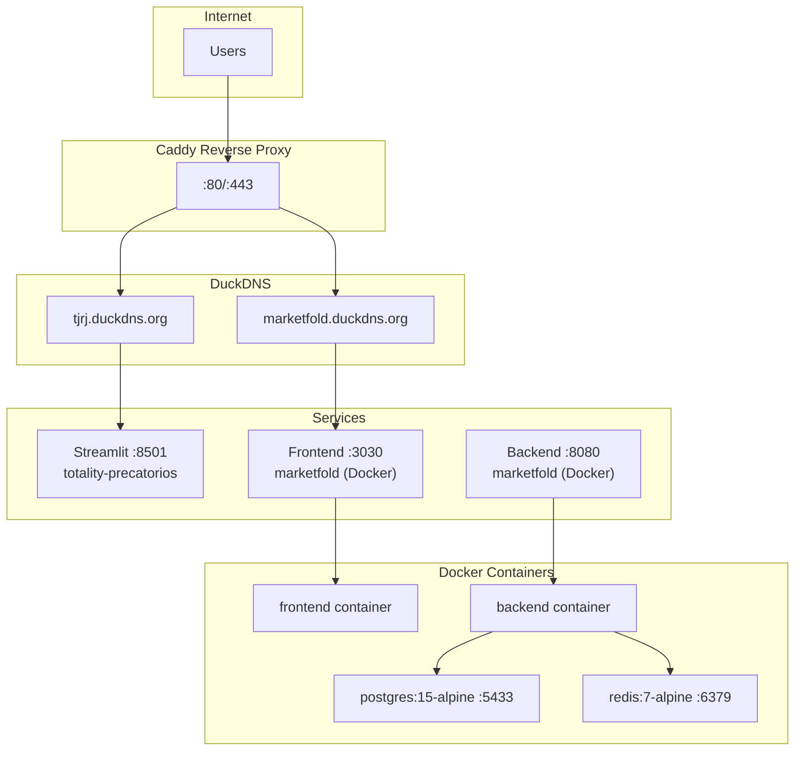

# VPS Backup & Recovery Guide

## 📋 VPS Overview

| Item | Value |
|------|-------|
| **IP** | 209.126.12.243 |
| **OS** | Ubuntu 24.04 LTS |
| **RAM** | 47GB |
| **Python** | 3.12.3 |
| **User** | root |

---

## 🏗️ VPS Architecture



---

## 📁 Components to Backup

### 1. Totality Precatórios Project
```
/root/charles/totality-precatorios/
├── app/                    # Streamlit UI
├── src/                    # Core modules
├── main_v*.py              # Extraction scripts
├── gap_recovery.py         # Gap recovery
├── output/                 # CSV/Excel files (15MB)
├── logs/                   # Extraction logs (4.5MB)
└── venv/                   # Virtual environment (940MB)
```

### 2. Marketfold Project (Docker)
```
/root/deploy-vps/
├── docker-compose.yml      # Docker config
├── .env                    # Environment variables
├── backend/                # FastAPI backend
├── frontend/               # Next.js frontend
└── data/                   # Application data
```

### 3. System Configuration
```
/etc/caddy/Caddyfile        # Reverse proxy config
/root/duckdns/update.sh     # DuckDNS updater
/etc/ufw/                   # Firewall rules
```

### 4. Docker Volumes
```
deploy-vps_postgres_data    # PostgreSQL data
```

---

## 🔄 Backup Procedures

### Quick Backup Script

```bash
#!/bin/bash
# backup_vps.sh - Run from local machine

DATE=$(date +%Y%m%d_%H%M%S)
BACKUP_DIR="./backups/vps_$DATE"
VPS="root@209.126.12.243"
PASS="Mark3tf0ld2025"

mkdir -p "$BACKUP_DIR"

echo "=== Backing up Totality Precatórios ==="
sshpass -p "$PASS" rsync -avz --exclude='venv' --exclude='__pycache__' \
    "$VPS:/root/charles/totality-precatorios/" "$BACKUP_DIR/totality-precatorios/"

echo "=== Backing up Marketfold ==="
sshpass -p "$PASS" rsync -avz --exclude='node_modules' --exclude='__pycache__' \
    "$VPS:/root/deploy-vps/" "$BACKUP_DIR/deploy-vps/"

echo "=== Backing up System Config ==="
sshpass -p "$PASS" scp "$VPS:/etc/caddy/Caddyfile" "$BACKUP_DIR/"
sshpass -p "$PASS" scp -r "$VPS:/root/duckdns/" "$BACKUP_DIR/"

echo "=== Backing up Docker Volumes ==="
sshpass -p "$PASS" ssh "$VPS" "docker exec deploy-vps-postgres-1 pg_dump -U postgres > /tmp/postgres_backup.sql"
sshpass -p "$PASS" scp "$VPS:/tmp/postgres_backup.sql" "$BACKUP_DIR/"

echo "=== Backup complete: $BACKUP_DIR ==="
du -sh "$BACKUP_DIR"
```

### Automated Daily Backup (Cron)

Add to local crontab:
```bash
# Daily backup at 3 AM
0 3 * * * /path/to/backup_vps.sh >> /var/log/vps_backup.log 2>&1
```

---

## 🔧 Recovery Procedures

### Full VPS Recovery

```bash
#!/bin/bash
# restore_vps.sh - Restore from backup

BACKUP_DIR="./backups/vps_YYYYMMDD_HHMMSS"  # Set to backup date
VPS="root@209.126.12.243"
PASS="Mark3tf0ld2025"

echo "=== Step 1: System Packages ==="
sshpass -p "$PASS" ssh "$VPS" "apt update && apt install -y python3 python3-pip python3-venv docker.io docker-compose caddy"

echo "=== Step 2: Restore Totality Precatórios ==="
sshpass -p "$PASS" rsync -avz "$BACKUP_DIR/totality-precatorios/" "$VPS:/root/charles/totality-precatorios/"
sshpass -p "$PASS" ssh "$VPS" "cd /root/charles/totality-precatorios && python3 -m venv venv && source venv/bin/activate && pip install -r requirements.txt && playwright install chromium"

echo "=== Step 3: Restore Marketfold ==="
sshpass -p "$PASS" rsync -avz "$BACKUP_DIR/deploy-vps/" "$VPS:/root/deploy-vps/"
sshpass -p "$PASS" ssh "$VPS" "cd /root/deploy-vps && docker-compose up -d"

echo "=== Step 4: Restore System Config ==="
sshpass -p "$PASS" scp "$BACKUP_DIR/Caddyfile" "$VPS:/etc/caddy/Caddyfile"
sshpass -p "$PASS" rsync -avz "$BACKUP_DIR/duckdns/" "$VPS:/root/duckdns/"
sshpass -p "$PASS" ssh "$VPS" "systemctl restart caddy"

echo "=== Step 5: Restore PostgreSQL ==="
sshpass -p "$PASS" scp "$BACKUP_DIR/postgres_backup.sql" "$VPS:/tmp/"
sshpass -p "$PASS" ssh "$VPS" "docker exec -i deploy-vps-postgres-1 psql -U postgres < /tmp/postgres_backup.sql"

echo "=== Step 6: Setup DuckDNS Cron ==="
sshpass -p "$PASS" ssh "$VPS" "echo '*/5 * * * * /root/duckdns/update.sh >/dev/null 2>&1' | crontab -"

echo "=== Step 7: Setup Firewall ==="
sshpass -p "$PASS" ssh "$VPS" "ufw allow OpenSSH && ufw allow 80/tcp && ufw allow 443/tcp && ufw allow 8501/tcp && ufw --force enable"

echo "=== Step 8: Start Services ==="
sshpass -p "$PASS" ssh "$VPS" "cd /root/charles/totality-precatorios && source venv/bin/activate && nohup streamlit run app/app_v2.py --server.port 8501 --server.address 0.0.0.0 > logs/streamlit.log 2>&1 &"

echo "=== Recovery Complete ==="
```

---

## 📊 Service Status Check

```bash
#!/bin/bash
# check_vps_status.sh

VPS="root@209.126.12.243"
PASS="Mark3tf0ld2025"

echo "=== Service Status ==="
sshpass -p "$PASS" ssh "$VPS" "
echo 'Streamlit:' && curl -s -o /dev/null -w '%{http_code}' http://localhost:8501 && echo
echo 'Caddy:' && systemctl is-active caddy
echo 'Docker:' && docker ps --format 'table {{.Names}}\t{{.Status}}' | head -5
echo 'DuckDNS:' && curl -s https://tjrj.duckdns.org -o /dev/null -w '%{http_code}' && echo
"
```

---

## 🔐 Credentials Summary

| Service | Credential |
|---------|------------|
| **SSH** | root / Mark3tf0ld2025 |
| **DuckDNS Token** | 13f2518c-b0b5-414b-94e6-121d03b817d6 |
| **Domains** | tjrj.duckdns.org, marketfold.duckdns.org |

---

## ⚠️ Important Notes

1. **venv not backed up** - Recreate with `pip install -r requirements.txt`
2. **Playwright browsers** - Reinstall with `playwright install chromium`
3. **Docker volumes** - PostgreSQL data backed up via pg_dump
4. **Logs** - Optional backup, can be large

---

## 📅 Backup Schedule Recommendation

| Frequency | What |
|-----------|------|
| **Daily** | output/, logs/, postgres_backup.sql |
| **Weekly** | Full project backup (excluding venv) |
| **Monthly** | Full system config backup |

---

## 🚨 Emergency Recovery Checklist

1. [ ] Provision new VPS (Ubuntu 24.04)
2. [ ] Install base packages (python3, docker, caddy)
3. [ ] Restore projects from backup
4. [ ] Recreate virtual environments
5. [ ] Restore Docker containers
6. [ ] Restore Caddy config
7. [ ] Setup DuckDNS cron
8. [ ] Configure firewall
9. [ ] Start services
10. [ ] Verify all endpoints

---

**Last Updated**: 2025-12-04
